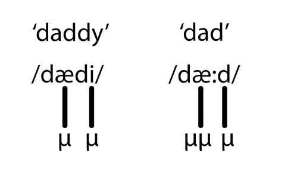
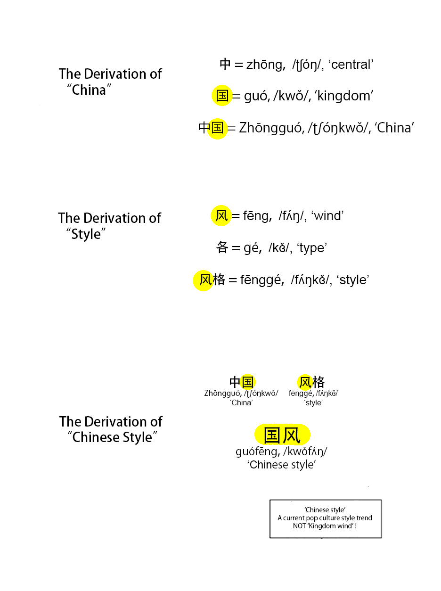
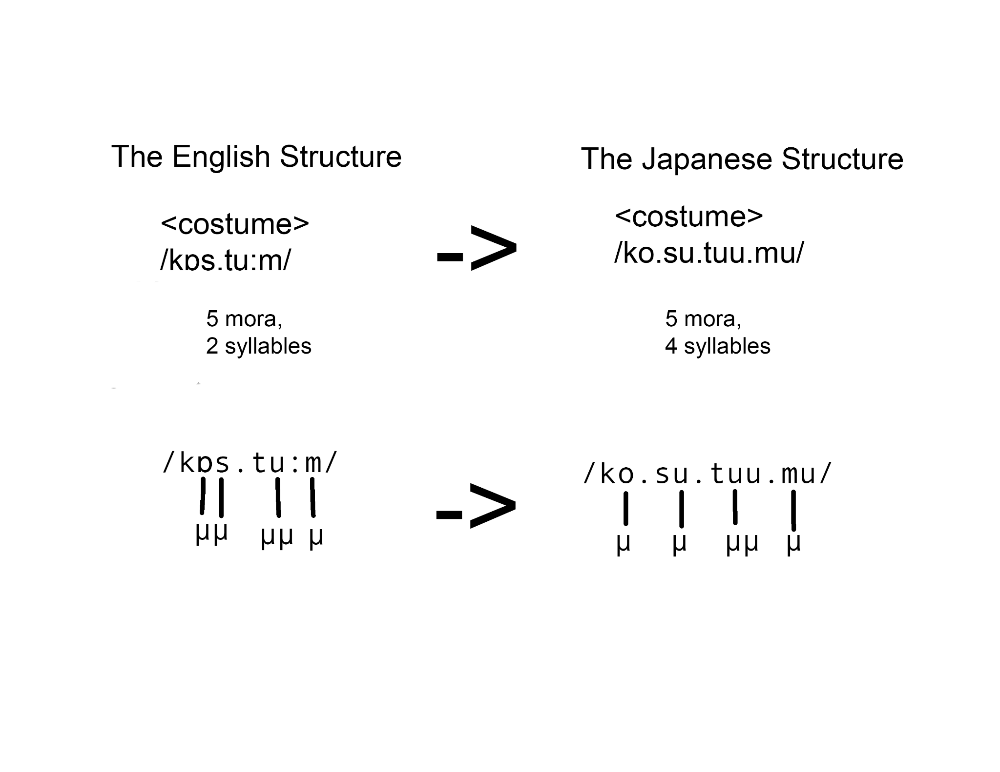
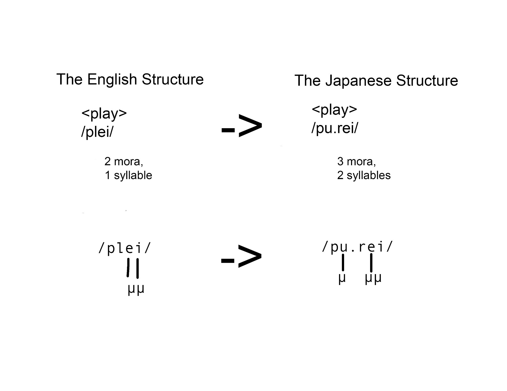
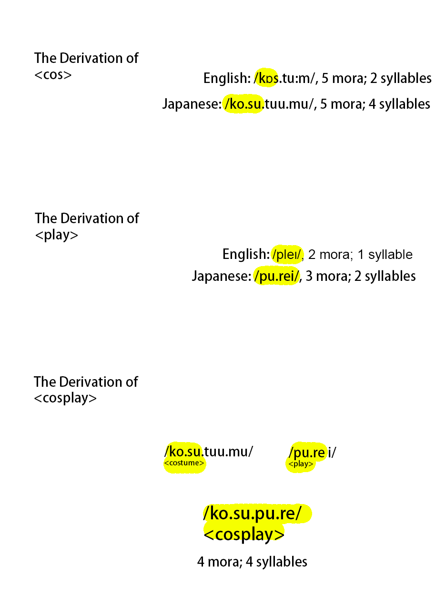

Most English speakers know the word "cosplay," and some use it every day. Many of them also know that the word has its origins in a Japanese-origin portmanteau of "costume" and "play." But a question this brings up and that may not be asked enough is: "Why?"

Only contact linguistics, the study of how languages directly and indirectly influence each other, can answer this!

While the act of cosplaying could be summarized as costume play, English words are not  formed in this way! Portmanteaus are typically reserved for wordplay (where even there they work quite differently). And regular compounds like "science degree" don't form words like "scideg." 

No, 'cosplay' is not trivial or incidental.

## Some background on Chinese compounding

To answer this question, we need to look at Chinese compounding derivational morphology. Derivational Morphology is the process by which languages form new words. Here's some basic facts about Chinese words we'll need:

1. Chinese words are one or two syllables, and not more.
 - In Old Chinese, they were always one. In modern Chinese, they can be two. Some loaned nouns get to three or more, but it's very uncommon.
2. Chinese words are frequently loaned into other East Asian languages. They can be written with the same characters but often very different pronunciations.
- This can come from either the native word being assigned to the Chinese character, or the Chinese phonological form being loaned. (But it will still change over time to be different from how it was in the Chinese variety of origin!)
3. Chinese syllables are typically two mora.
 - A mora is a theoretical timing unit of speech. Syllables are nearly always said to be either short (at one mora), or long (at least two mora). 
 - Typically, when people observe that some languages seem to be "faster" than others, this is because those languages are made up of mostly short syllables, like Spanish or Japanese. 
  - English has a heavily mixed syllable set of short and long syllables.
 - An easy way to understand mora would be checking how long it takes to say "dad" and "daddy." While most people assume that "daddy" would take longer to say, as it has two syllables, "dad" takes longer to say, because it has one additional mora. Things with more mora take more time to say!
- (Mora are represented with the Greek letter μ.)

4. Chinese words are typically formed by compounding one syllable from two other words together. The compounding process can happen multiple times to form a word, meaning that a single word can be composed of more than two underlying words. But only two syllables can be represented in the end, since Chinese words can't be composed of more than two syllables.

Here's a fun example of how "Chinese style" as a single word can be derived despite the surface form only having two syllables: one meaning "country" and one meaning "wind":

## How Japanese borrows the pattern

This lays the foundation of our journey to understanding 'cosplay.' But we don't just need to know Chinese derivational compounding. We also need to know how the process has been used in other languages: In this case, Japanese.

Ever since Japan entered the written Sinosphere in the 7th century, new Japanese words have been formed according to Chinese derivational compounding rules. So, do we take one syllable from each root word? Well, not quite. Japanese syllables, unlike Chinese syllables, are nearly always one mora. Chinese words loaned into Japanese typically get restructured, with each long syllable becoming two short syllables. 

A Chinese two-syllable word, 'ji.rou' (4 mora, 2 syllables), meaning chicken meat, gets remodeled in Japanese as 'to.ri.ni.ku' (4 mora, 4 syllables).

But why does any of this matter for 'cosplay'? Well, cosplay is a *Japanese* word. And it was formed according to how Japanese typically forms words — the Chinese compounding derivational process. Words are typically formed by taking two mora, rather than one syllable, from each root.

Shown below, we can see how the words 'costume' and 'play' got remodeled to fit into Japanese phonology in the first place. The English roots for these words happen to only be made up of two-mora syllables, just like most Chinese words. The Japanese adaptations of the words end up a little longer, because vowels need to be inserted to make them pronounceable.

So we get /ko.su.tuu.mu/ and /pu.rei/ in the end. While a mora has been added to each word from the insertion of a new vowel, there's nothing stopping us from applying the usual pattern (loaned from Chinese) of derivational compounding and chopping two mora off of each word to make a new one!

## Putting it together: deriving "cosplay"

Taking the first two mora of /ko.su.tuu.mu/ (costume) — /ko.su/ — and the first two mora of /pu.rei/ (play) — /pu.re/ — and compounding them:

By usual Japanese practice, the new word is written with either katakana, a special set of glyphs showing that it is of foreign (and non-Chinese) origin, or with the orthography of the root language. As /ko.su/ represents \<cos\>, and /pu.re/ represents \<play\>, we can write /ko.su.pu.re/ as \<cosplay\>.

## The English back-loan

English speakers then picked up this new word, 'cosplay,' and back-loaned it for themselves. 'Cosplay,' a word formed from English roots, can only have its etymological origins understood through a trilingual indirect loaning chain of derivational morphology processes!

At least, that's how the written word "cosplay" came to be. Although in Japan it represented the pronunciation /kosupure/, when English speakers first read "cosplay," it looked like a new word whose pronunciation had to be guessed from its spelling.
 
A fun artifact from this is that you'll often hear it pronounced /kɒzpleɪ/, with a /z/, despite the fact that the original word "costume" and the Japanese form are both pronounced with an /s/!

Derivational contact of this sort is common throughout the world. It has been ongoing throughout history but was previously neglected in historical linguistics, particularly by the philologists of the 19th and 20th centuries. Modern contact linguists and historical linguists study it heavily!